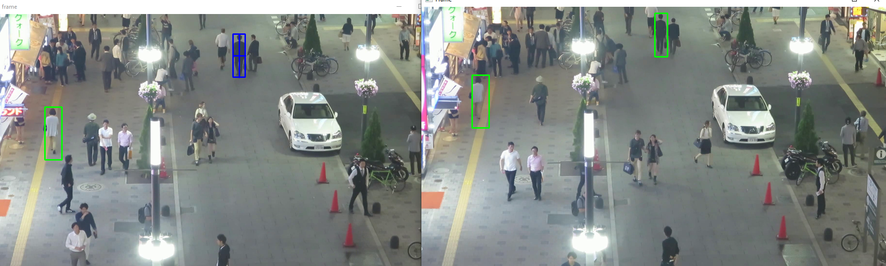

# OpenCV Multi Tracker Object Tracking

## Overview

This project is a object tracking system that tracks selected objects using OpenCV tracking algorithms.

There are several algorithms that you can use:

- Boosting
- MIL
- **KCF**
- TLD
- MedianFlow
- CSRT
- MOSSE

You can use CSRT for higher accuracy, but low FPS as a side effect.

You can use MOSSE for higher speed, but slightly lower accuracy.

In this example video, KCF has best results with faster FPS and considerable accuracy.

## Usage

Run `MOT.py`.
Press `t` to open to select region of interest window. You can select your object to track with your mouse.
When you are done, press `space` to continoue video. If you want to select another object, you can press `t` again.

## Requirements

The project requires Python 3.7 or above and listed libraries:

- opencv

### Author

- LinkedIn - [Ömer Fatih Bülbül](https://www.linkedin.com/in/ömer-fatih-bülbül-74a890236/)
- Twitter - [fatihbulbul91](https://twitter.com/fatihbulbul91)
